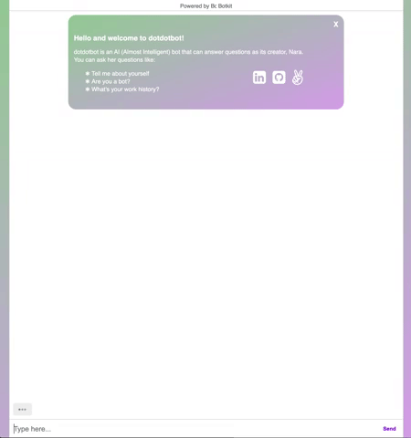

# dotdotbot

[Live Site](http://narasbot.herokuapp.com/)

### Introduction
dotdotbot is an AI (Almost Intelligent) chatbot that can answer easy to less easy questions about her creator, Nara.
dotdotbot was named after the three typing indicator dots or the ellipsis (...) to denote "thinking" to simulate human-like interactions (psychologically).
#### Sub-Intro
dotdotbot is equipped with multiple compartments of threads and conversations that are all conntected to one another.
This way, making changes to conversations and threads won't put dotdotbot out of sync, and practices one of computer science design principles: separation of concerns. dotdotbot mainly thinks through recognizing patterns and executing based on the relevant handler.

Pattern Handler example:
```javascript
contact.addQuestion('You can end this chat by saying end or say continue to go back to the main menu', [
    {
        pattern: new RegExp(/(end|quit|bye)/),
        handler: async function(res, convo, bot) {
            await bot.say(`Thanks for stopping by! Good bye!`);
            return await bot.cancelAllDialogs();
        }
    },
    {
        pattern: new RegExp(/(continue|more)/),
        handler: async function(res, convo, bot) {
            // await bot.say(`You want to know about my work history`);
            return await bot.beginDialog('main_thread_repeat');
        }
    }], 'decision', 'second');
```

### Instruction

###### Once a user enters the creator's chat channel, dotdotbot will greet the user. The user can greet dotdotbot back to trigger the bot to standby for commands and questions.
--


### Commands
Try asking questions like:
   ##### About
    * Tell me about yourself
      * When dotdotbot tells you about herself, ask her to tell you about herself again.
    * Who are you?
   ##### Experience
    * Can you tell me about your experience?
    * Any work history?
   ##### Education
    * Where did you go to school?
    * What was your major?
    * Education history, please.
   ##### Tech Stack
    * What languages do you know?
    * What's your tech stack?
   ##### Fun Facts
    * Can you share some fun facts about yourself?
   ##### Projects
    * Got any projects?
      *When dotdotbot replies that she does, ask her to "prove it"
   ##### Resume
    * Do you have a resume?
   ##### Contact
    * Do you have LinkedIn?
    * How can I contact you?
    * What is your email?

### Technology
dotdotbot was created using botkit.js and is hosted on heroku.
Unfortunately, due to 'dotdotbot' being taken as a heroku domain, users can meet and chat with dotdotbot here: [Narasbot](https://narasbot.herokuapp.com/)

### Typing Indicator Middleware
To mitigate from falling into reduntant usage of the typing indicator added as a message and reply, a `use` middleware was attached to filter all user triggered repsonses from the bot to take a pause, then start typing before executing a response.
```javascript
    controller.middleware.receive.use((bot, message, next) => {
        bot.reply(message, { type: "typing" });
        setTimeout(async () => {
        next();
        }, 800);
    });
```

#### If intriguing, the repository containing dotdotbot can be downloaded or cloned. Once cloned:
  1. Go to the dotdotbot directory.
  2. Then from the top level directory, run `npm start` to run the script or `nodemon bot.js`.
  3. From there, dotdotbot will be waiting at localhost port 3000.
  4. Enjoy!
  
### -----
#### More about Botkit

### Botkit Starter Kit

This is a Botkit starter kit for web, created with the [Yeoman generator](https://github.com/howdyai/botkit/tree/master/packages/generator-botkit#readme).

To complete the configuration of this bot, make sure to update the included `.env` file with your platform tokens and credentials.

[Botkit Docs](https://botkit.ai/docs/v4)

This bot is powered by [a folder full of modules](https://botkit.ai/docs/v4/core.html#organize-your-bot-code). 
Edit the samples, and add your own in the [features/](features/) folder.
